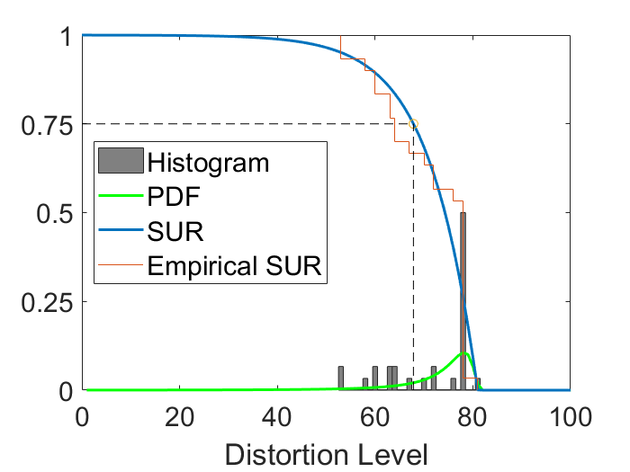
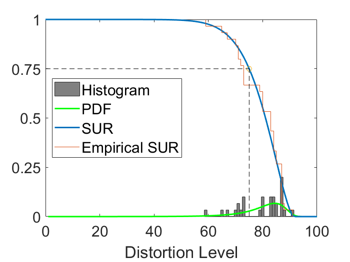
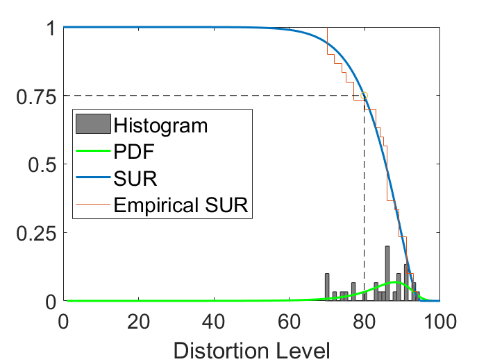
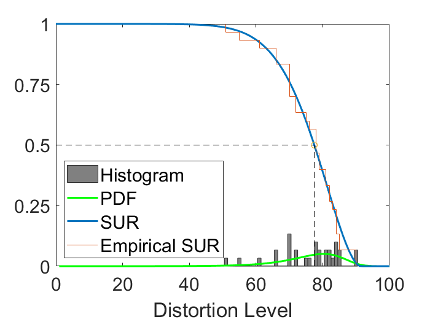
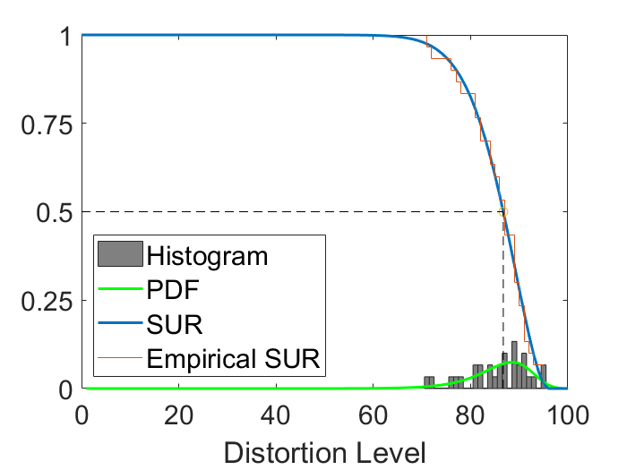
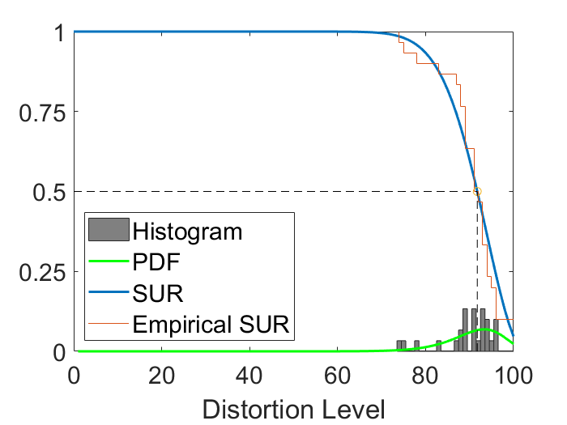

# JND-project
 Codes for my undergraduate final year project and part of our research paper.
 
## About my personal JND project
`FYP_codes_to_be_submitted` folder contains the codes for my undergraduate final year projects which is about *Perceptual experience and deep learning-based image/video compression & quality evaluation* based on JND (Just-Noticeable-Difference) concept. 
I also wrote a GUI APP which summarized all the features of the proposed algorithm, it mainly contains three tabs:

First tab: (description goes here...)

Second tab: (description goes here...)

Third tab: (description goes here...)

**Note**: In order to run the APP correctly, you might need to change some lines in the [code](https://github.com/seabro917/JND-project/blob/main/FYP_codes_to_be_submitted/App/JND_app_improved_upgraded.mlapp) which specify the data directly.

## About our paper
`JND_summer_project` folder contains codes for generating some of the figures in our research paper "*SUR-FeatNet: Predicting the satisfied user ratio curve for image compression with deep feature learning*", the paper can be found [here](https://link.springer.com/article/10.1007/s41233-020-00034-1).

  
  
