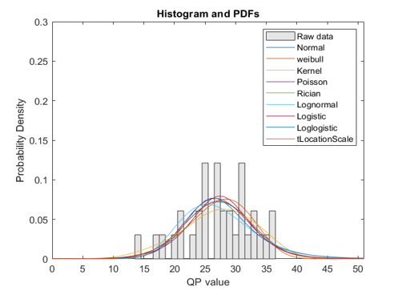
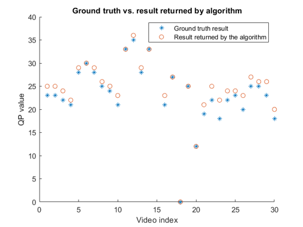

# JND-project
 Codes for my undergraduate final year project and part of our research paper.
 
## About my B.Eng. JND project
`FYP_codes_to_be_submitted` folder contains the codes for my undergraduate final year project which is about "*Perceptual experience and deep learning-based image/video compression & quality evaluation*" based on JND ([Just-Noticeable-Difference](https://en.wikipedia.org/wiki/Just-noticeable_difference)) concept, a metric that takes the human perceptual system into consideration when performing image/video quality assessment. 

This project mainly includes the following works:
- Goodness-of-fit evaluation: Find the most suitable PDF (probability density function) model that fits the distribution of the sample JND data in [VideoSet](https://www.sciencedirect.com/science/article/pii/S1047320317300950) dataset.
- Bitrate modeling: Model the relationship between [QP](https://trac.ffmpeg.org/wiki/Encode/H.264) value (compression parameter of H.264 scheme) and video bitrate.
- Algorithm proposal: Design and implement a video compression algorithm based on JND and bitrate, compromising between user visual experience and cost of resources. Given a PDF model, a bitrate constraint, and a SUR (satisfied user rate) constraint, the proposed algorithm can return the JND point such that, when the original video is compressed with this JND point, the compressed video is able to satisfy all the specified constraints and maximize users' visual experience as much as possible at the same time.  

> ***P.S.*** The satisfied user ratio (SUR) is the fraction of users that do not perceive any distortion when comparing the original image to its compressed version. In other words, it implies the fraction of users that will ***not*** notice the artifacts in the compressed video, i.e., ***"satisfied"*** by the compressed video in terms of visual experience.

### Some results visualization
#### Fitting raw JND data with different parametric PDF models

<p align = "center">
  
</p>

<p align = "center">
 <sub>Fig. 1: JND sample histogram (left) and SUR curves (right) when different PDF models are considered.</sub>
</p>

#### Finding the most suitable PDF for modeling the JND samples
<p align = "center">
   
</p>

<p align = "center">
 <sub>Fig. 2: Number of times that the distribution fitting result passes the K-S hypothesis test when different PDF models are considered.</sub>
</p>

#### Modeling the relationship between bitrate and QP value
<p align = "center">
  
</p>

<p align = "center">
 <sub>Fig. 3: Curve fitting for QP vs. bitrate, video clips with index 19 (left) and 59 (right).</sub>
</p>

#### Testing the main algorithm
<p align = "center">
  
</p>

<p align = "center">
 <sub>Fig. 4: Ground truth results vs. results returned by the algorithm.</sub>
</p>


### Front end GUI APP - JND Figure
I also wrote a GUI APP which summarized all the above works, it mainly contains three tabs - correspond to the three major works:

- First tab - Goodness-of-fit evaluation: Given different videos and corresponding JND data in the dataset, fit different PDF models to the raw data and use K-S test statistic for evaluating the goodness-of-fit (in our paper, instead of K-S test, we use A-D test, which is another hypothesis test. We utilize p-value of the hypothesis test and negative log-likelihood value of MLE as the evaluating metrics). 

<p align = "center">

</p>

<p align = "center">
 <sub>Fig. 5: First tab of the designed APP.</sub>
</p>

- Second tab - Bitrate modeling: Use three ground truth values of raw data to fit the exponential curve and model the relationship between QP values and the bitrate of the videos in the dataset.
<p align = "center">

</p>

<p align = "center">
 <sub>Fig. 6: Second tab of the designed APP.</sub>
</p>


- Third tab - Proposed algorithm: Given a specified PDF model, a bitrate constraint, and a SUR constraint, the proposed algorithm will output the found JND point.
<p align = "center">

</p>

<p align = "center">
 <sub>Fig. 7: Third tab of the designed APP.</sub>
</p>

> **Note**: In order to run the APP correctly, you might need to modify some lines in the [code](https://github.com/seabro917/JND-project/blob/main/FYP_codes_to_be_submitted/App/JND_app_improved_upgraded.mlapp), which specify the data directory (I have already provided the data in three excel files `1280x720_1st.csv`, `1280x720_2nd.csv` and `1280x720_3rd.csv`).


## About our paper
`JND_summer_project` folder contains part of the codes for our research paper "*SUR-FeatNet: Predicting the satisfied user ratio curve for image compression with deep feature learning*", the paper can be found [here](https://link.springer.com/article/10.1007/s41233-020-00034-1). 

Specifically, the folder contains the codes for generating the following figures and tables. In `nll_values` and `p_values` folders, you can find the data shown in the table, that is; negative log-likelihood values of MLE and p-values of A-D test evaluated on the samples in [MCL-JCI](https://mcl.usc.edu/mcl-jci-dataset/) and [JND-Pano](https://link.springer.com/chapter/10.1007/978-3-030-00776-8_42) datasets, based on the evaluating algorithm described in our paper.

<p align = "center">
   
   
</p>

<p align = "center">
 <sub>Fig. 8: SUR curve and 75% SUR of the first three JNDs. The data is for the fifth (top three figs) and 14th (bottom three figs) source images in the MCL-JCI dataset.</sub>
</p>


<p align = "center">
  
</p>

<p align = "center">
 <sub>Table. 1: Ranking of the distribution models according to negative log-likelihood of MLE and A–D test for the 50 source images of the MCL-JCI dataset and the 40 images of the JND-Pano dataset.</sub>
</p>

> **Note**: The models are from Matlab (R2019b): Half-normal (1), Rayleigh (2), Exponential (3), Generalized Extreme Value
(4), Generalized Pareto (5), Stable (6), tLocation Scale (7), Birnbaum-Saunders (8), Extreme Value (9), Gamma (10), Logistic (11), Loglogistic (12), LogNormal (13), Nakagami (14), Normal (15), Poisson (16), Rician (17), Weibull (18). Results for the two other models available in Matlab, beta distribution and Burr distribution, are not included as fitting the JND samples with the distributions was not possible. The negative loglikelihoods and p values are available in the folders of this repo as mentioned above.

Based on the ranking result shown in Table. 1, model 4), which corresponds to Generalized Extreme Value Distribution, is the most suitable one for describing and modeling JND samples and this finding will be utilized in this work to help us train the deep learning model for SUR curve prediction.  


In this paper, we propose the first deep learning approach to predict SUR curves. The proposed approach relies on a siamese convolutional neural
network, transfer learning, and deep feature learning. The model utilizes image pairs consisting of a reference image and a compressed image for training. Full model implementation code can be found in this [repo](https://github.com/Linhanhe/SUR-FeatNet).

Please consider citing our paper with the following entry if you find the above codes and information useful to you
```@article{lin2020featnet,
  title={SUR-FeatNet: Predicting the satisfied user ratio curve for image compression with deep feature learning},
  author={Lin, Hanhe and Hosu, Vlad and Fan, Chunling and Zhang, Yun and Mu, Yuchen and Hamzaoui, Raouf and Saupe, Dietmar},
  journal={Quality and User Experience},
  volume={5},
  pages={1--23},
  year={2020},
  publisher={Springer}
}
```
